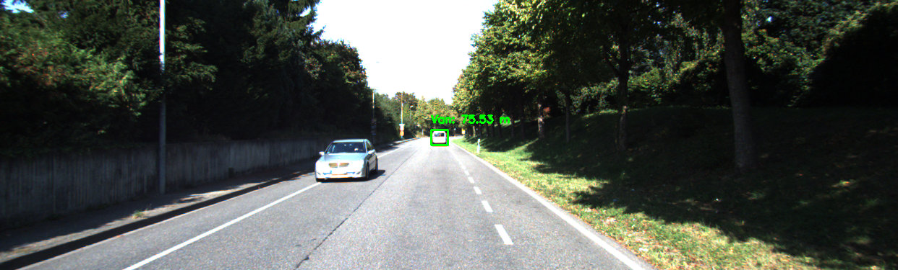

# Landmark-Based Robot Localization Using YOLO and Monocular Distance Estimation

A computer vision assignment for M.Sc. Mechatronics coursework: detecting a distant vehicle in a KITTI dataset image using YOLOv8, then estimating its real-world distance from the camera using monocular vision geometry (the pinhole camera model).



## Overview

The goal was to detect and localize a distant white van in a KITTI benchmark image and estimate how far it was from the camera — using only a single 2D image, no stereo or depth sensor.

## How It Works

1. **Detection** — A pre-trained YOLOv8 (`yolov8n`) model runs object detection on the input image
2. **Filtering** — Detected boxes are filtered by pixel height to isolate distant, small objects (nearby vehicles are excluded)
3. **Distance estimation** — For each remaining detection, distance is estimated using the pinhole camera model:

   ```
   distance = (focal_length × real_object_height) / height_in_pixels
   ```

4. **Visualization** — The detected object is boxed and labeled with its estimated distance directly on the image

## Result

The model detected the distant white van and estimated its distance at approximately **75.5 meters**, consistent with its position in the frame.

## Tech Stack

Python, Ultralytics YOLOv8, OpenCV

## Running It

```bash
pip install ultralytics opencv-python
python main.py
```

## Limitations

Distance estimation here is an approximation — it depends on assumed constants for the object's real-world height and the camera's focal length, and single-camera (monocular) vision doesn't provide true depth. Stereo vision or a depth sensor would give more reliable results.

## What I Learned

This assignment connected object detection with basic projective geometry to solve a practical robotics localization problem — a good example of how classical computer vision principles (the pinhole camera model) still combine usefully with modern deep learning detectors.
